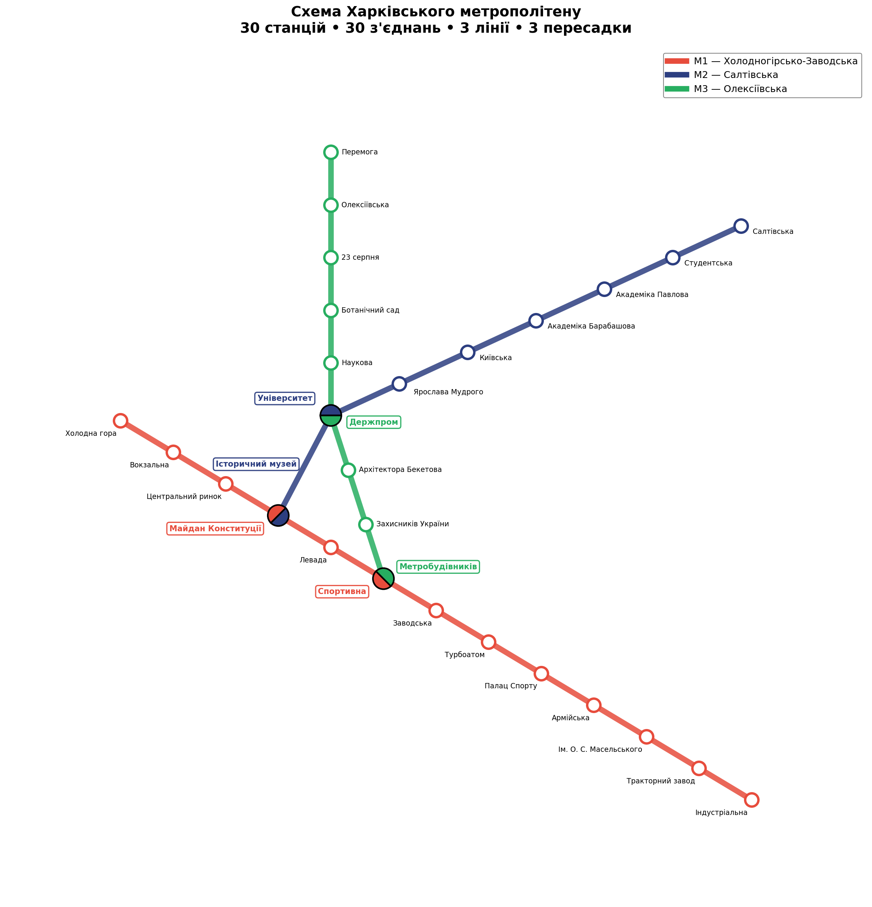
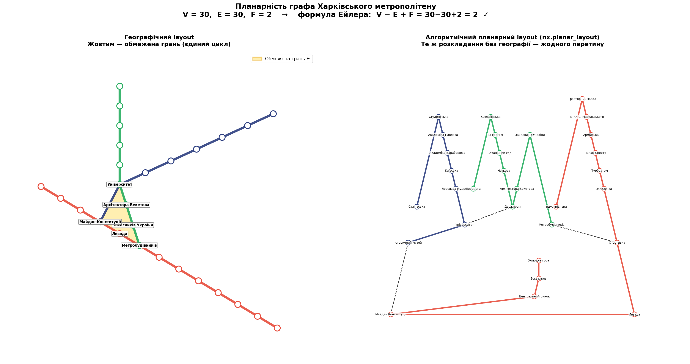
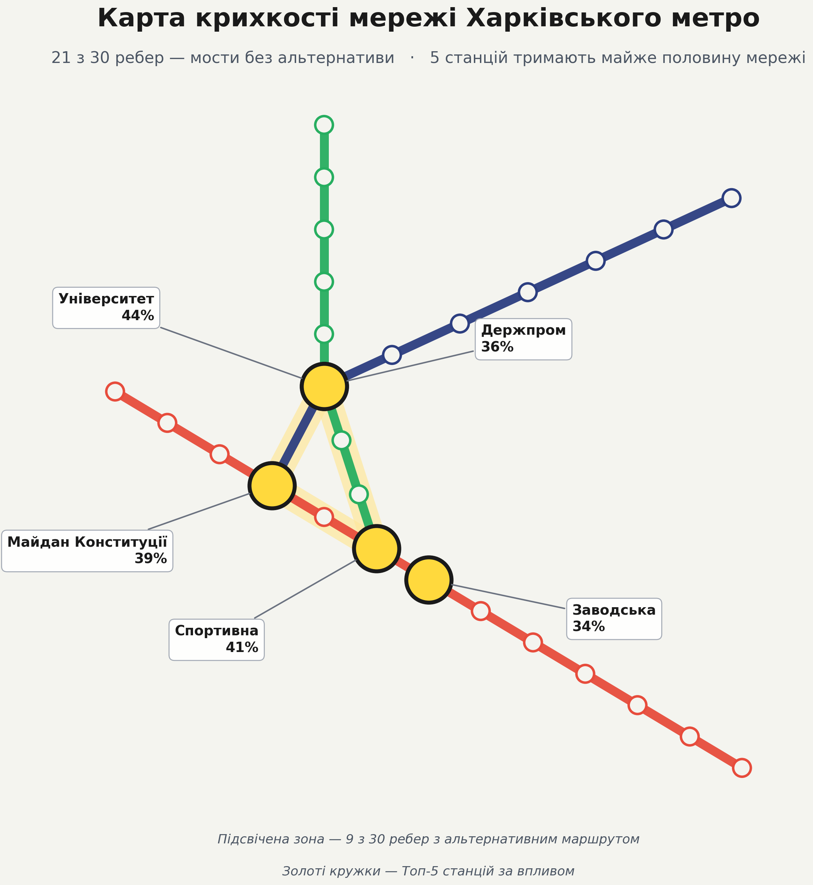
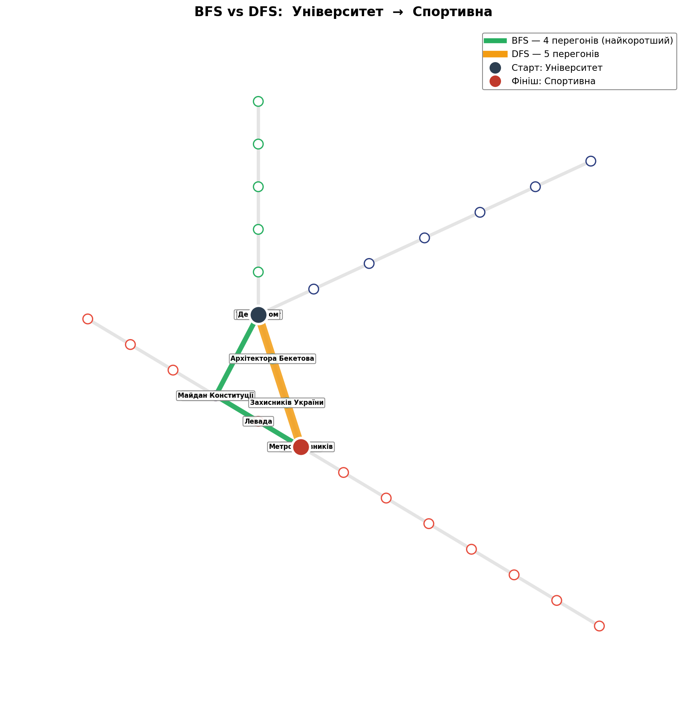
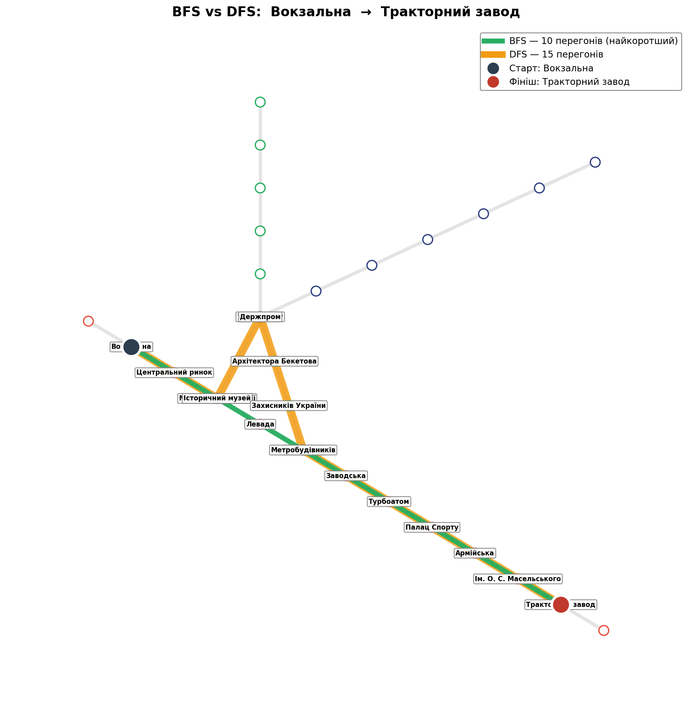
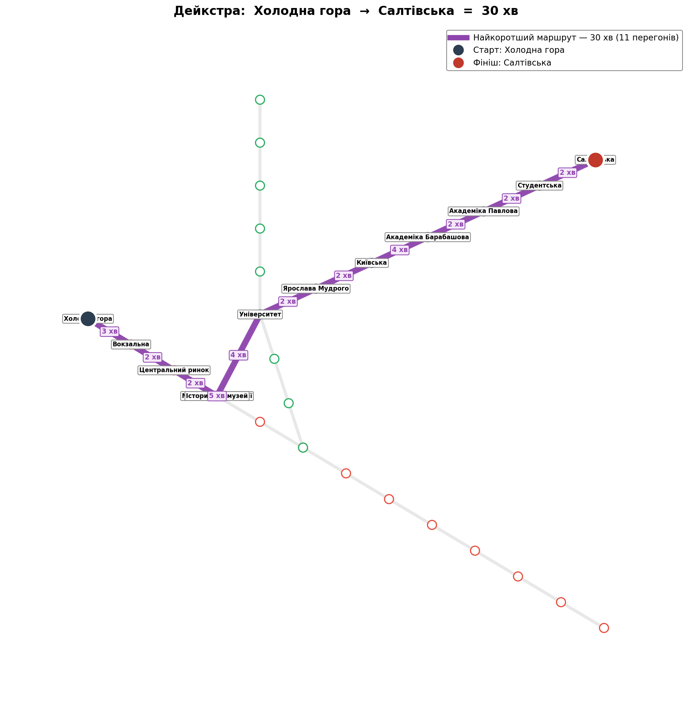
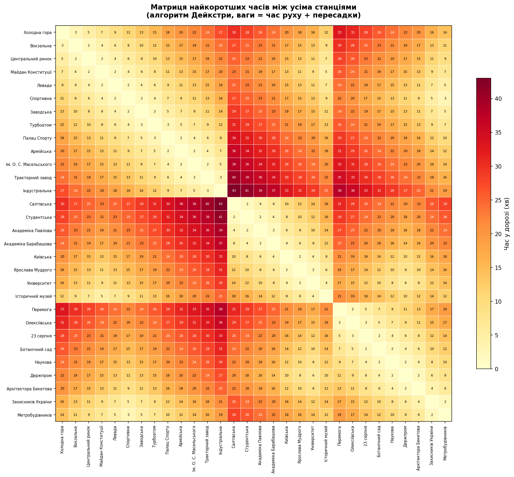
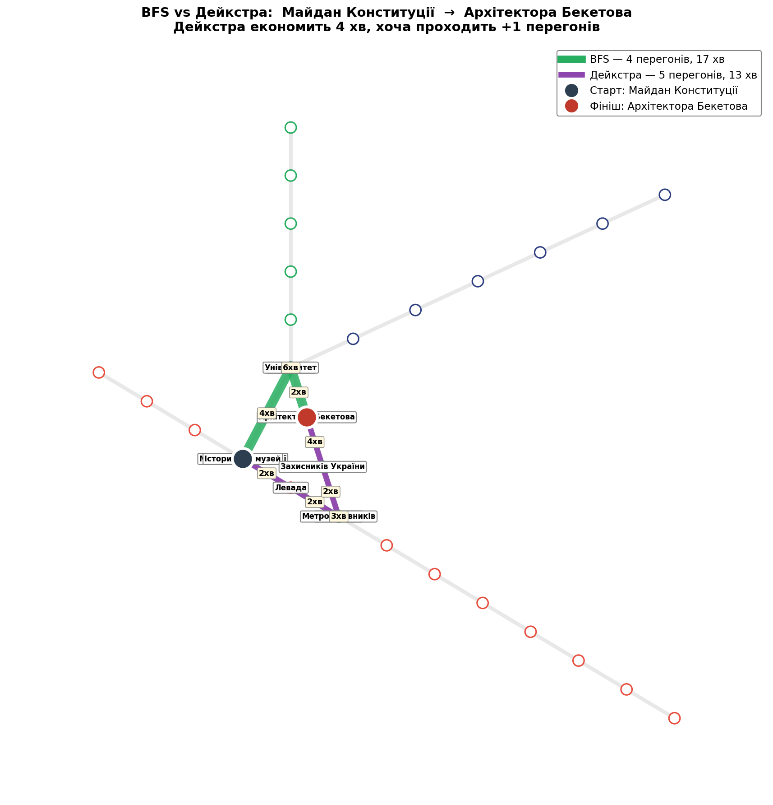
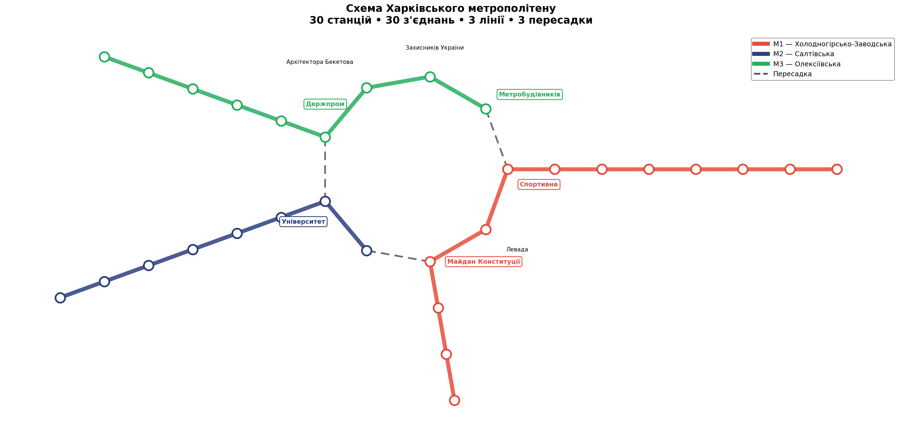

# Аналіз графа Харківського метрополітену

Дослідження мережі Харківського метро з позиції теорії графів: побудова, візуалізація, аналіз структури, пошук маршрутів алгоритмами BFS, DFS і Дейкстри.



---

## 📦 Структура репозиторію

```
kharkiv-metro-graph/
├── kharkiv_metro/              # основний пакет
│   ├── __init__.py             # публічний API
│   ├── data.py                 # дані: лінії, пересадки, час руху
│   ├── graph.py                # побудова графа (зваженого/незваженого)
│   ├── layout.py               # координати станцій (2 варіанти розкладки)
│   ├── algorithms.py           # BFS, DFS, Дейкстра
│   ├── analysis.py             # статистика мережі, планарність
│   └── visualization.py        # рендер усіх схем і графіків
├── scripts/                    # запускачі для кожного завдання
│   ├── task1_network_analysis.py
│   ├── task2_bfs_dfs.py
│   ├── task3_dijkstra.py
│   └── circular_layout.py
├── notebooks/                  # оригінальні Jupyter-ноутбуки
│   ├── kharkiv_subway.ipynb
│   └── one_circle.ipynb
├── images/                     # згенеровані зображення
├── requirements.txt
├── pyproject.toml
└── README.md
```

## ⚙️ Встановлення та запуск

```bash
git clone <repo-url>
cd kharkiv-metro-graph

# Створити віртуальне оточення (рекомендовано)
python -m venv .venv
source .venv/bin/activate  # Windows: .venv\Scripts\activate

# Встановити залежності
pip install -r requirements.txt

# Запустити всі завдання
python scripts/task1_network_analysis.py
python scripts/task2_bfs_dfs.py
python scripts/task3_dijkstra.py
python scripts/circular_layout.py
```

Альтернативно — встановити пакет (тоді можна імпортувати `kharkiv_metro` з будь-де):

```bash
pip install -e .
```

---

## 🎯 Завдання 1. Побудова графа та аналіз мережі

Граф моделюється так:
- **вершини** — 30 станцій метро;
- **ребра** — 27 перегонів між сусідніми станціями плюс 3 пересадкові з'єднання між лініями.

Усі статичні дані (лінії, пересадки, ваги ребер) винесені в `kharkiv_metro/data.py` у вигляді `dataclass`-ів — додавання нової станції вимагає правки лише в одному місці.

### 📊 Базові характеристики

```
Кількість станцій:  30
Кількість з'єднань: 30
Щільність:          0.0690
Зв'язний:           Так
```

Граф **зв'язний** — з будь-якої станції можна дістатися до будь-якої іншої, що є базовою вимогою транспортної системи. Щільність дуже низька (**0.069**), що характерно для лінійних транспортних мереж: лише близько 7% можливих пар станцій з'єднані безпосередньо. Структура близька до дерева, оскільки три цикли в графі утворюються лише завдяки замкненому трикутнику пересадок у центрі.

### 📈 Ступені вершин

Розподілені від 1 до 3 з точним середнім **2.00**:

- **Ступінь 1** мають шість кінцевих станцій-терміналів — по одному з кожного боку трьох ліній (*Холодна гора, Індустріальна, Перемога, Метробудівників, Салтівська, Історичний музей*).
- **Ступінь 2** — більшість внутрішніх станцій з одним сусідом з кожного боку.
- **Ступінь 3** мають лише пересадкові станції, де до двох сусідів по своїй лінії додається з'єднання з вузлом на іншій лінії.

### 🚪 ТОП-5 ключових станцій за посередництвом

| № | Станція | Betweenness |
|---|---|---|
| 1 | Університет | **0.443** |
| 2 | Спортивна | **0.409** |
| 3 | Майдан Конституції | **0.387** |
| 4 | Держпром | **0.362** |
| 5 | Заводська | **0.340** |

Очікувано очолюють пересадкові вузли — через ці чотири пересадкові станції проходить від 36% до 44% усіх найкоротших шляхів у мережі. Особливе місце посідає **Університет** — це єдина пересадка між синьою та зеленою лініями, що робить її критичним вузлом усієї системи: вихід її з ладу призведе до значного подовження маршрутів між північною частиною мережі та центром. П'яте місце посідає **Заводська** — не пересадкова, але стратегічно розташована між пересадкою Спортивна/Метробудівників та південно-східною частиною червоної лінії, тож велика частина шляхів від найвіддаленіших станцій до решти мережі змушена проходити через неї.

### 🗺️ Структурні характеристики

- **Діаметр мережі: 17 перегонів** — найдовший найкоротший шлях між двома станціями, який пролягає між *Індустріальною* та *Салтівською* (кінцеві точки червоної та синьої ліній відповідно).
- **Середня відстань: 6.37 перегону** — типова поїздка триває близько шести зупинок.

### 🚇 Розподіл станцій між лініями

| Лінія | Назва | Станцій |
|---|---|---|
| 🔴 **M1** | Холодногірсько-Заводська | 13 |
| 🟢 **M3** | Олексіївська | 9 |
| 🔵 **M2** | Салтівська | 8 |

Розподіл нерівномірний: червона M1 містить майже вдвічі більше станцій, ніж синя M2. Це відображає історичну розбудову системи — червона лінія є найстарішою та обслуговує найбільшу довжину міста.

### 🎯 Висновки за топологією

Мережа має класичну структуру міського метрополітену малого міста: три радіальні лінії, що сходяться в центральному трикутнику пересадок **Університет–Майдан Конституції–Спортивна**. Низька щільність і мала кількість циклів означає **високу структурну вразливість** — вихід з ладу однієї пересадкової станції суттєво погіршує зв'язність мережі.

З точки зору розвитку, ключовим напрямком зміцнення системи могло б стати створення **додаткових пересадок між периферійними ділянками ліній**, що зменшило б навантаження на центральні вузли та підвищило стійкість мережі загалом.

### 🗺️ Планарність графа

**Планарний граф** — це граф, який можна намалювати на площині так, щоб жодні два ребра не перетиналися (за винятком спільних вершин). За теоремою Куратовського граф планарний тоді й тільки тоді, коли він не містить підграфа, що є підрозбиттям K₅ (повного графа на 5 вершинах) або K₃,₃ (повного двочасткового 3+3).

Для зв'язних планарних графів виконується **формула Ейлера**:

$$V - E + F = 2$$

де V — кількість вершин, E — ребер, F — граней (включно з зовнішньою нескінченною).



Граф Харківського метрополітену є **планарним** (підтверджено алгоритмом `nx.check_planarity` та формулою Ейлера: `V − E + F = 30 − 30 + 2 = 2`). Це означає, що мережу можна намалювати на площині без жодного перетину ребер — що ми і робимо у звичній схемі метро.

**Циклічний ранг мережі μ = E − V + 1 = 1** — у графі існує рівно один незалежний цикл (девʼятивершинна петля навколо центрального трикутника пересадок). Це найважливіша структурна характеристика: з 30 ребер лише 9 належать цьому циклу, а решта **21 є мостами** — їхнє видалення розриває мережу на дві незв'язні компоненти. Лише в межах цього єдиного циклу існує альтернативний маршрут між станціями; всі інші частини мережі мають по одному єдиному шляху, що робить їх критично вразливими до відключень.

За нерівністю Ейлера для простих планарних графів виконується **E ≤ 3V − 6**, тобто для нашого випадку 30 ≤ 84. Мережа використовує лише близько 36% теоретично дозволеного запасу планарності. Це означає, що до системи можна додати велику кількість нових ліній або пересадок, і граф залишиться планарним.

Планарність харківського метро не є випадковою властивістю, а **відображає універсальну закономірність усіх реальних транспортних мереж**: вони фізично існують на (майже) двовимірній поверхні Землі, тому їхні графові моделі майже завжди планарні. Перетин маршрутів у реальному світі практично завжди супроводжується пересадковою станцією, яка в графі стає окремою вершиною, а не "перехрестом ребер".

### 🟡 Підсумкова карта крихкості



Підсвічена жовтим зона — це 9 ребер єдиного циклу, де існують альтернативні маршрути. Усе решта — мости.

---

## 🎯 Завдання 2. Пошук шляхів через DFS і BFS

Для побудованого графа знаходимо шляхи між станціями двома алгоритмами обходу:

- **BFS** обходить граф рівнями: спочатку усі сусіди стартової вершини, потім усі сусіди сусідів, і так далі. На неоднозначних графах **гарантовано знаходить найкоротший шлях** (за кількістю ребер).
- **DFS** іде якнайглибше в одному напрямку, поки не впреться у відвідану вершину або тупик, а потім повертається назад (backtracking). **Не гарантує найкоротшого шляху** — може повернутися з довгим маршрутом, якщо обрав «довший» напрямок на роздоріжжі.

Обидва алгоритми мають складність O(V + E) і для нашого графа виконуються миттєво.

### 🔬 Логіка добору тестових пар

Чотири пари обиралися свідомо, щоб показати **різні топологічні ситуації** і продемонструвати, коли DFS відрізняється від BFS, а коли ні. З аналізу планарності ми знаємо, що цикловий ранг графа μ = 1 — у мережі є рівно один цикл. Між парами станцій, де хоча б один кінець не лежить на цьому циклі, маршрут зазвичай єдиний — і обидва алгоритми дадуть однаковий результат. Різниця виникає лише там, де є вибір «з якого боку» обходити центральну петлю.

| Маршрут | BFS | DFS | Збіг |
|---|---|---|---|
| Холодна гора → Салтівська | 11 | 11 | ✓ |
| Університет → Спортивна | 4 | 5 | ✗ |
| Перемога → Індустріальна | 16 | 17 | ✗ |
| Вокзальна → Тракторний завод | 10 | 15 | ✗ |

**Холодна гора → Салтівська** (BFS = DFS = 11) — це маршрут між кінцевими станціями двох різних ліній. Здавалося б, тут має бути різниця, але результати збіглися. Це **контрприклад**: обидві станції лежать на «хвостах» поза циклом, тому вхід (через Майдан Конституції) і вихід (через Університет) географічно зафіксовані — обидва алгоритми змушені знайти один і той самий маршрут.

**Університет → Спортивна** (BFS = 4, DFS = 5) — найбільш **дидактичний** приклад. Обидві станції є вершинами центрального циклу, тож шлях буквально лежить усередині петлі, а два можливі маршрути — це обхід циклу з протилежних боків. BFS обирає коротший бік, DFS — довший.



**Перемога → Індустріальна** (BFS = 16, DFS = 17) — найдовший маршрут через все місто. Різниця становить лише 1 перегон, хоча сам маршрут дуже довгий. Це показує, що відмінність між BFS і DFS **не залежить від загальної довжини шляху** — вона виникає тільки у локальній зоні навколо циклу.

**Вокзальна → Тракторний завод** (BFS = 10, DFS = 15) — найдраматичніший приклад з різницею у 50%. Обидві станції лежать на одній лінії (червоній). Інтуїтивно здавалось би, що тут різниці бути не може — їдь собі прямо. Але виходить навпаки: DFS бачить пересадку на Майдан Конституції, обирає її і робить великий гак через синю та зелену лінії, перш ніж повернутися на червону.



### 🔎 Аналіз результатів

**BFS гарантує найкоротший шлях**, бо обходить граф рівнями: спочатку всі вершини на відстані 1 від старту, потім на відстані 2, і так далі. Перший раз, коли алгоритм досягає кінцевої станції, він робить це найкоротшим маршрутом — це фундаментальна властивість пошуку в ширину для неоднозначних графів.

**DFS не оптимізує довжину**, бо просто йде якнайглибше в одному напрямку. Він знаходить *перший-ліпший* шлях, не порівнюючи його з альтернативами.

У нашому графі **21 з 30 ребер є мостами**. Це означає, що між більшістю пар станцій існує лише **один-єдиний шлях** — і обидва алгоритми змушені знайти саме його. Різниця проявляється лише тоді, коли і старт, і фініш розташовані так, що шлях має проходити через **центральний цикл з 9 станцій**.

### 🎯 Висновок

DFS і BFS на цьому графі демонструють класичну поведінку:
- BFS — оптимальний для пошуку **найкоротшого** маршруту (за кількістю перегонів);
- DFS — швидкий для перевірки **самого факту досяжності**, але може дати неоптимальний шлях.

Для практичної задачі планування поїздки метро BFS є очевидним вибором — він гарантує мінімум перегонів. DFS у транспортних застосуваннях зазвичай використовують для інших цілей: пошуку компонентів зв'язності, виявлення циклів, топологічного сортування.

---

## 🎯 Завдання 3. Алгоритм Дейкстри на зваженому графі

У попередніх завданнях усі ребра вважалися рівнозначними — рахувалася лише кількість перегонів. Тепер додамо до графа **ваги**, що відповідають реальному часу руху поїздів між сусідніми станціями (у хвилинах), а пересадкам — часу переходу між платформами.

**Принцип роботи Дейкстри.** Алгоритм починає зі стартової вершини з відстанню 0 і поступово «відкриває» найближчі вершини, кожного разу обираючи ще не відвідану вершину з найменшою поточною відстанню. Для оптимальної реалізації використовується **бінарна купа** (priority queue) — це дає складність `O((V + E) · log V)`.

**Дані про ваги.** Час руху між сусідніми станціями взято з розкладу метро (2–4 хв на перегон). Часи пересадок: Університет ↔ Держпром — 6 хв (різні лінії, треба перейти через довгий тунель), Історичний музей ↔ Майдан Конституції — 5 хв, Спортивна ↔ Метробудівників — 3 хв.

### 📊 Результати на тестових парах

| Маршрут | Час | Перегонів |
|---|---|---|
| Холодна гора → Салтівська | 30 хв | 11 |
| Університет → Спортивна | 13 хв | 4 |
| Перемога → Індустріальна | 38 хв | 16 |
| Вокзальна → Тракторний завод | 21 хв | 10 |
| Холодна гора → Індустріальна | 27 хв | 12 |

**Зважений діаметр мережі: 43 хв** (Індустріальна → Салтівська). Це найдовший найкоротший шлях у мережі — найгірший сценарій для пасажира, який їде між найвіддаленішими станціями оптимальним маршрутом.



### 🌡️ Теплова карта часів між усіма парами станцій



На матриці найкоротших часів чітко видно **блокову структуру**: світлі трикутники по діагоналі — це поїздки в межах однієї лінії (швидкі), а яскраво-червоні зони — поїздки між кінцевими станціями різних ліній з обов'язковими пересадками. Пересадки додають 3–6 хв «штрафу» до часу маршруту, що добре пояснює, чому деякі переміщення «дорого» коштують навіть на відносно невелику кількість перегонів.

Маючи матрицю V×V = 30×30 = 900 значень найкоротших часів, можна обчислити агреговані характеристики: середній час поїздки в мережі, ідентифікувати «найдешевші» та «найдорожчі» пари станцій, оцінити вплив додавання або видалення ребра/пересадки на загальну зв'язність. Це класичний інструмент для планування транспорту.

### 🆚 Порівняння BFS і Дейкстри на тих самих парах станцій

BFS оптимізує **кількість перегонів**, Дейкстра — **загальний час**. У більшості випадків ці критерії дають той самий маршрут, але є пари, де вони розходяться: коли коротший за перегонами шлях має «дорогі» ребра (довгі пересадки 5–6 хв або 4-хвилинні перегони).

У нашому графі таких пар знайдеться **11 з 435 можливих** — приблизно 2.5%:

```
Пара                                          BFS           Дейкстра      Економія
================================================================================
Холодна гора → Архітектора Бекетова           7 рб, 24 хв    8 рб, 20 хв     4 хв
Вокзальна → Архітектора Бекетова              6 рб, 21 хв    7 рб, 17 хв     4 хв
Центральний ринок → Архітектора Бекетова      5 рб, 19 хв    6 рб, 15 хв     4 хв
Майдан Конституції → Архітектора Бекетова     4 рб, 17 хв    5 рб, 13 хв     4 хв
Левада → Перемога                             9 рб, 28 хв   10 рб, 24 хв     4 хв
Левада → Олексіївська                         8 рб, 26 хв    9 рб, 22 хв     4 хв
Левада → 23 серпня                            7 рб, 23 хв    8 рб, 19 хв     4 хв
Левада → Ботанічний сад                       6 рб, 21 хв    7 рб, 17 хв     4 хв
Левада → Наукова                              5 рб, 19 хв    6 рб, 15 хв     4 хв
Левада → Держпром                             4 рб, 17 хв    5 рб, 13 хв     4 хв
Історичний музей → Захисників України         4 рб, 16 хв    5 рб, 14 хв     2 хв
```



**Аналіз прикладу: Майдан Конституції → Архітектора Бекетова**

Дві станції лежать на центральному циклі мережі та можуть бути з'єднані двома альтернативними маршрутами навколо цього циклу.

**Шлях BFS** (4 перегони, 17 хв) — мінімізує кількість зупинок. Іде «коротшою стороною» через дві пересадки: Майдан Конституції → Історичний музей (5 хв) → Університет (4 хв) → Держпром (6 хв) → Архітектора Бекетова (2 хв). Сума двох пересадок дає 11 хв «штрафу» — алгоритм цього не бачить, бо рахує лише ребра.

**Шлях Дейкстри** (5 перегонів, 13 хв) — мінімізує час у дорозі. Іде «довшою стороною» через одну дешеву пересадку: Майдан Конституції → Левада (2 хв) → Спортивна (2 хв) → Метробудівників (3 хв) → Захисників України (2 хв) → Архітектора Бекетова (4 хв). Один зайвий перегон, але дешева пересадка Спортивна/Метробудівників (3 хв) суттєво виграє у дорогих Іст. музей/Майдан + Університет/Держпром (5 + 6 = 11 хв).

**Економія Дейкстри становить 4 хвилини** — це 23% від часу BFS.

### 🎯 Загальний висновок

Із 435 можливих пар станцій ($C^2_{30} = 435$) лише в 11 (близько 2.5%) BFS і Дейкстра дають різні маршрути. У всіх цих 11 випадках Дейкстра проходить через **на один перегон більше**, але через **меншу кількість дорогих пересадок** — і виграє в часі від 2 до 4 хв. Це типовий патерн для транспортних мереж: оптимізація за реальним часом часто потребує «жертви» додатковими перегонами заради уникнення довгих пересадок.

---

## 🎨 Додаток: альтернативна схема з пересадками як окремими станціями

Друга візуалізація (з ноутбука `one_circle.ipynb`) — це схематичне представлення, де кожна пересадка показана як **дві окремі станції**, з'єднані коротким пунктирним ребром. 9 станцій центрального циклу розставлені рівномірно по колу (полігон), а решта — радіально назовні.



Це представлення зручніше для аналізу алгоритмів — структура центрального циклу видно одразу.

---

## 📚 Посилання на код

- Дані мережі: [`kharkiv_metro/data.py`](kharkiv_metro/data.py)
- Побудова графа: [`kharkiv_metro/graph.py`](kharkiv_metro/graph.py)
- Розклади координат: [`kharkiv_metro/layout.py`](kharkiv_metro/layout.py)
- Алгоритми (BFS, DFS, Дейкстра): [`kharkiv_metro/algorithms.py`](kharkiv_metro/algorithms.py)
- Аналіз мережі та планарності: [`kharkiv_metro/analysis.py`](kharkiv_metro/analysis.py)
- Усі функції рендеру: [`kharkiv_metro/visualization.py`](kharkiv_metro/visualization.py)
- Оригінальні Jupyter-ноутбуки: [`notebooks/`](notebooks/)

## 🛠️ Технології

- **Python 3.9+**
- **NetworkX** — побудова та аналіз графів
- **Matplotlib** — візуалізація
- **NumPy** — теплова карта

## 📄 Ліцензія

MIT
